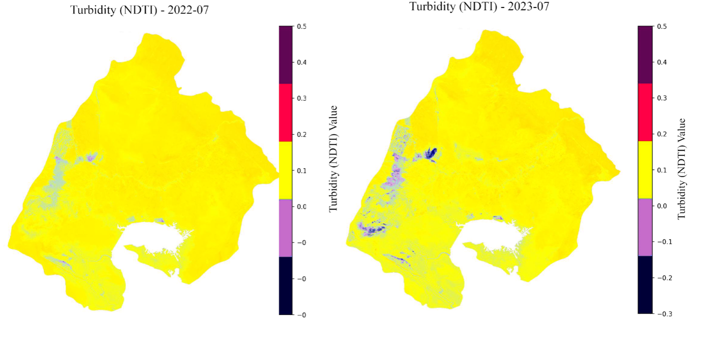
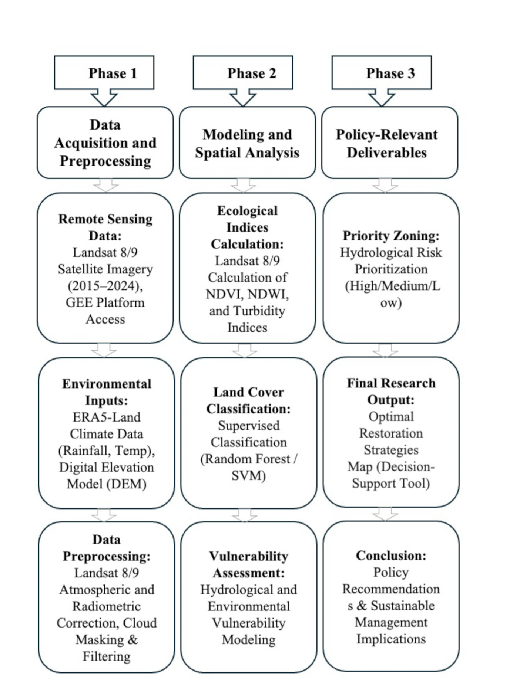
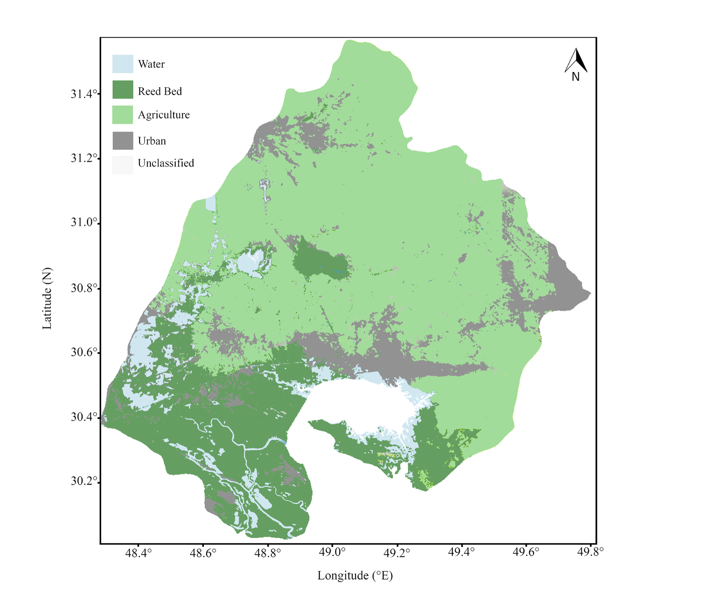
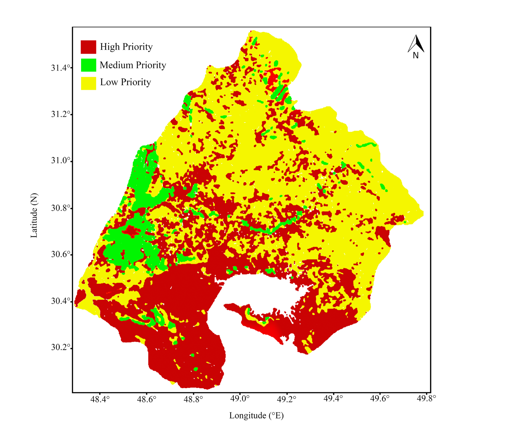
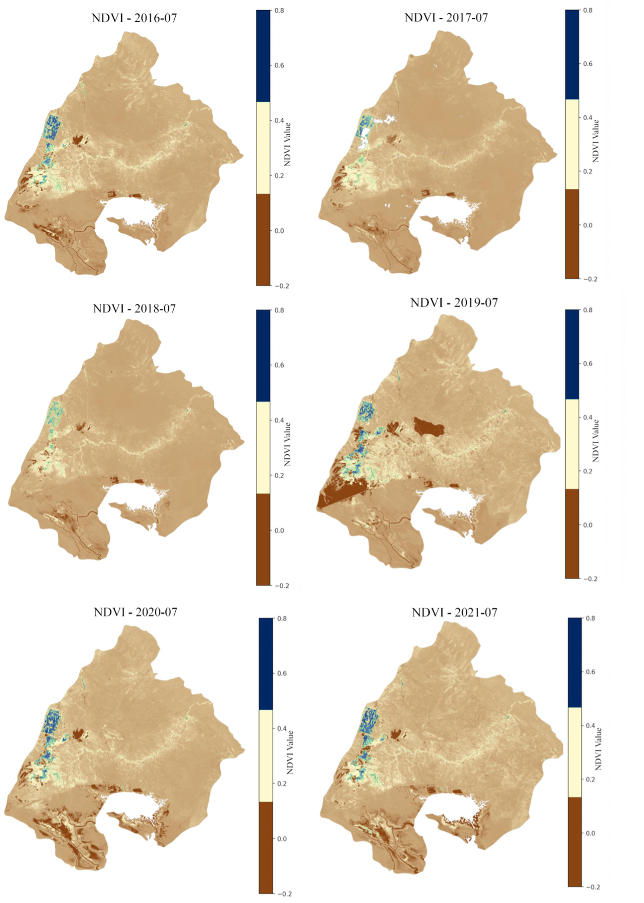
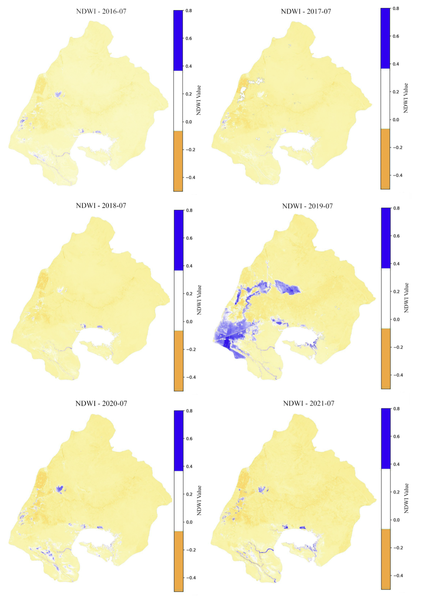
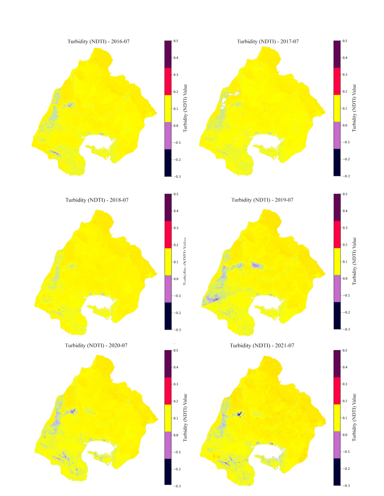

# A Spatially Explicit Decision Support Framework for Wetland Resilience

## Shadegan Wetland, Iran

> Integrating Random Forest, Google Earth Engine (GEE), and Administrative Boundaries to Guide Restoration (2015–2024)

---

## 📌 Project Overview

This project presents a data-driven, spatially explicit decision-support framework for the restoration of **Shadegan Wetland** — the largest wetland in Iran and the Middle East (a Ramsar site).  

Using multi-temporal Landsat 8/9 imagery and ERA5-Land climate data in Google Earth Engine, combined with Random Forest modeling and local expert knowledge (habitat sensitivity + water zoning), we developed an **Optimal Restoration Strategies Map** to prioritize interventions.

**Model Accuracy**: 98.1% (Kappa = 0.971)

---

## 🗺️ Key Maps

### Optimal Restoration Strategies Map (Main Result)


### Methodology Workflow


### Land Cover Classification Map


### Hydrological Risk Prioritization Map


---

## 📊 Spatio-Temporal Trends (2015–2024)

  
  


---

## 📊 Key Results

| Class                  | Accuracy | Kappa  | Dominant Predictors          |
|------------------------|----------|--------|------------------------------|
| Very High / High       | 98.1%    | 0.971  | Habitat sensitivity          |
| Overall Model          | 98.1%    | 0.971  | Water zoning + sensitivity   |

**Significant decline** in water and vegetation cover + rising turbidity (2015–2024)

---

## 🔑 Key Findings

- Synergistic impact of drought, upstream diversions, and pollution
- Very High and High habitat sensitivity are the strongest spatial predictors
- Clear north-south gradient in degradation
- Model successfully integrates remote sensing with local planning data for actionable zoning

---

## ⚙️ Methodology

All analysis performed in **Google Earth Engine** + **Random Forest / SVM**

### Ecological Indices
- NDVI  
- NDWI  
- Turbidity Index (NDTI)

### Tools

| Tool                    | Purpose                              |
|-------------------------|--------------------------------------|
| Google Earth Engine     | Landsat 8/9 + ERA5-Land processing   |
| Random Forest / SVM     | Vulnerability & strategy modeling    |
| QGIS                    | Final map production                 |

---

## 📁 Repository Structure

```bash
├── Optimal_Restoration_Strategies_Map2.png
├── Methodology_Workflow.png
├── Land_Cover_Classification.png
├── Hydrological_Risk_Prioritization_Map.png
├── Spatio_Temporal_Distribution_maps_of_*.png
├── README.md
└── Full_Report.pdf (after publication)
