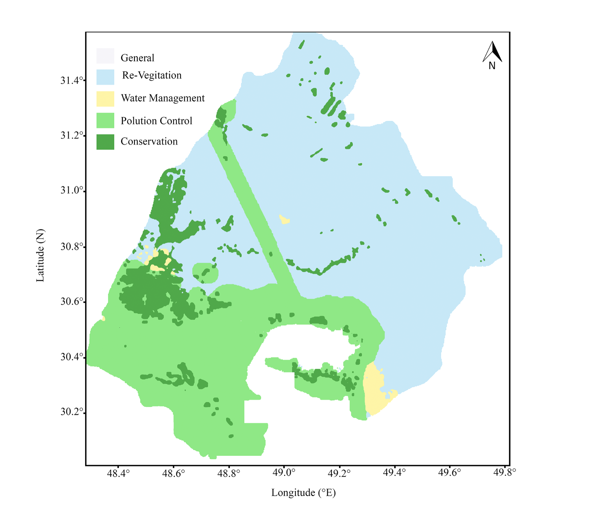

# Shadegan Wetland Restoration Framework

**Earth observation, geospatial machine learning, and spatial decision support for wetland restoration**

[](#requirements)
[](#reproducibility-and-data-access)
[](#citation)

## Project status

This repository is a curated research and reproducibility record accompanying a manuscript under review. It documents the analytical workflow, reported validation outputs, selected code, and final maps. Some local planning layers and Google Earth Engine assets cannot be redistributed publicly; therefore, the public repository supports **methodological review and partial reproduction**, rather than one-click reproduction of the full spatial analysis.

## Research objective

The project develops a spatially explicit decision-support framework for Shadegan Wetland, Iran, by integrating:

- multi-temporal Landsat 8/9 imagery (2015–2024);
- ERA5-Land temperature and precipitation;
- SRTM elevation;
- ESA WorldCover training information;
- ecological indicators, including NDVI, NDWI, and a turbidity-related spectral indicator;
- hydrological vulnerability;
- local management-plan layers, including habitat sensitivity and water zoning; and
- administrative boundaries for locally targeted restoration planning.

The final output is a five-category restoration-strategy map:

1. General Restoration  
2. Re-vegetation  
3. Water Management  
4. Pollution Control  
5. Conservation  

## Analytical workflow

1. **Earth-observation preprocessing**  
   Landsat 8/9 surface-reflectance imagery was filtered and processed in Google Earth Engine for the 2015–2024 study period.

2. **Environmental indicators**  
   Vegetation, surface-water, turbidity-related, climate, terrain, and land-cover predictors were derived and harmonised.

3. **Land-cover classification**  
   Random Forest and Support Vector Machine classifiers were compared for four classes: water, reedbed/wetland, agriculture, and urban/barren. The manuscript reports an average **five-fold cross-validation accuracy of 86.19%**. Random Forest was selected for the final map.

4. **Hydrological-vulnerability modelling**  
   NDVI, NDWI, turbidity, temperature, precipitation, DEM, NDVI trend, and land cover were integrated into a three-class priority model. Rule-derived ecological labels were used for training, followed by Random Forest classification and focal-median smoothing.

5. **Restoration-strategy modelling**  
   The priority map was combined with habitat sensitivity, water zoning, distance-based variables, and local planning information to produce spatially explicit intervention classes.

6. **Administrative translation**  
   The final strategy map was intersected with surrounding county boundaries to support local planning and resource allocation.

## Reported validation results

| Component | Reported result | Interpretation |
|---|---:|---|
| Land-cover classification | 86.19% mean accuracy | Five-fold cross-validation reported in the manuscript |
| Restoration-strategy classification | 98.1% overall accuracy; Kappa 0.971 | Recalculated from the manuscript's reported validation matrix |

The script [`scripts/validate_reported_metrics.py`](scripts/validate_reported_metrics.py) recalculates the restoration-strategy accuracy and Cohen's Kappa from the published confusion matrix stored in [`data/reported_restoration_confusion_matrix.csv`](data/reported_restoration_confusion_matrix.csv).

### Validation caveat

The restoration labels were generated using expert/rule-based criteria derived from the same planning and environmental variables used by the model. In addition, the reported confusion matrix contains no validation samples for the **General Restoration** class. These values should therefore be interpreted as **internal consistency against the rule-derived labels**, not as independent field validation of all five strategies. Field validation remains limited and is identified as a study limitation.

## Key outputs

### Optimal restoration strategies


### Methodological workflow


### Land-cover classification


### Hydrological vulnerability


## Repository structure

```text
.
├── README.md
├── requirements.txt
├── CITATION.cff
├── .gitignore
├── data/
│   └── reported_restoration_confusion_matrix.csv
├── scripts/
│   ├── validate_reported_metrics.py
│   └── shadegan_workflow_template.py
├── notebooks/
│   └── Shadegan_Wetland_Restoration_Demo.ipynb
├── docs/
│   └── REPRODUCIBILITY.md
└── selected maps and figures
```

## Quick start

### 1. Clone the repository

```bash
git clone https://github.com/sanazshuli/Shadegan-Wetland-Restoration-Framework.git
cd Shadegan-Wetland-Restoration-Framework
```

### 2. Create an environment

```bash
python -m venv .venv
source .venv/bin/activate        # macOS/Linux
# .venv\Scripts\activate         # Windows
pip install -r requirements.txt
```

### 3. Verify the reported strategy metrics

```bash
python scripts/validate_reported_metrics.py
```

### 4. Open the notebook

```bash
jupyter notebook notebooks/Shadegan_Wetland_Restoration_Demo.ipynb
```

The notebook verifies the reported matrix, visualises class support, and explains which parts of the full workflow require private/local spatial inputs.

## Requirements

- Python 3.10+
- Google Earth Engine account for geospatial processing
- Access to the required local planning layers and Earth Engine assets for full execution

## Reproducibility and data access

Public satellite and climate inputs can be accessed through Google Earth Engine. Local management-plan layers, digitised boundaries, and some derived Earth Engine assets are not redistributed because of source and access constraints.

To adapt the workflow:

1. copy `config.example.json` to `config.json`;
2. replace the example Earth Engine asset IDs and local paths;
3. authenticate Earth Engine;
4. run the workflow template section by section;
5. document any changes to thresholds, labels, spatial resolution, or sampling.

Do not commit credentials, private asset identifiers, or personally mounted Google Drive paths.

## Limitations

- Independent field validation of restoration-strategy classes is limited.
- Rule-derived training labels can inflate apparent classification performance.
- The General Restoration class has zero support in the reported validation matrix.
- Results depend on planning-layer quality, threshold choices, temporal sampling, and scale harmonisation.
- The framework is site-specific and requires recalibration before transfer to another wetland.

## Citation

The accompanying manuscript is under review:

> Shuli, S. *A Spatially Explicit Decision Support Framework for Wetland Resilience: Integrating Random Forest, GEE, and Administrative Boundaries to Guide Restoration in Shadegan, Iran.* Manuscript under review.

A machine-readable citation is provided in [`CITATION.cff`](CITATION.cff).

## Author

**Sanaz Shuli**  
Environmental GeoAI · Earth Observation · Wetland Resilience  
GitHub: [sanazshuli](https://github.com/sanazshuli)
